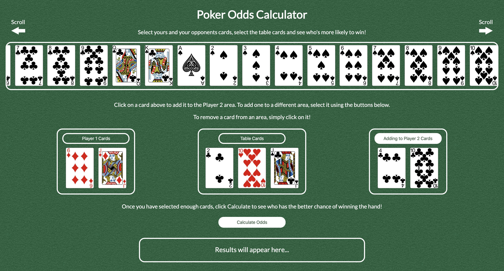

Poker Odds Calculator
---------------------

This is a single-page React app designed to calculate two players odds of winning or splitting a hand of Poker.

The calculation is based on the two players dealt hands and the first 3 cards to be dealt to the table (the flop).

The 'poker-odds-calculator' npm package was used to handle odds calculation.

Click [here](https://imh51.github.io/react-poker-calculator/) to try it out.

Screenshot:

